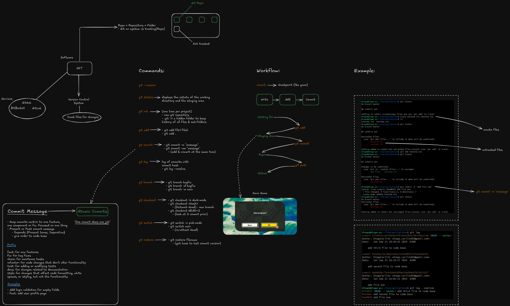

## Principais Comandos do Git

- `git --version`: Exibe a versão do Git instalada no sistema.
- `git status`: Mostra o estado atual do diretório de trabalho e da área de stage (arquivos preparados para commit).
- `git init`: Inicializa um novo repositório Git em um diretório. Utilizado uma vez por projeto.
- `git add`: Adiciona arquivos à área de stage. Exemplo: `git add file1 file2`.
- `git commit`: Salva as mudanças do diretório de trabalho no repositório local com uma mensagem descritiva. Exemplo: `git commit -m "mensagem"`.
- `git log`: Exibe o histórico de commits com detalhes como autor, data e mensagem do commit.
- `git branch`: Gerencia branches, criando, listando ou removendo. Exemplo: `git branch nova-feature`.
- `git checkout`: Alterna entre branches ou commits. Exemplo: `git checkout -b darkmode`.
- `git switch`: Alterna entre branches sem usar checkout. Exemplo: `git switch main`.
- `git restore`: Restaura arquivos para o estado de um commit anterior. Exemplo: `git restore nome-do-arquivo`.

## Workflow

O workflow básico do Git envolve três etapas principais:

- **Write (Escrever):** Os arquivos são modificados no diretório de trabalho.
- **Add (Adicionar):** As mudanças são adicionadas à área de stage com o comando git add, preparando-as para serem salvas.
- **Commit (Salvar):** As mudanças são registradas no repositório local com o comando git commit, criando um "checkpoint", similar a salvar um progresso em um jogo.

Após o commit, você pode **push (enviar)** essas mudanças para um repositório remoto como o **GitHub**, permitindo que outros colaboradores tenham acesso.

## Boas Práticas para Mensagens de Commit
Na parte da imagem referente às **mensagens de commit**, são apresentadas boas práticas para escrever mensagens claras e úteis, além do conceito de **Commits Atômicos**. Aqui está uma explicação detalhada:

### Boas Práticas para Mensagens de Commit

1. **Foque em uma única tarefa por commit**: Cada commit deve estar relacionado a uma mudança específica no código, preferencialmente uma funcionalidade ou correção. Isso ajuda a manter o histórico de mudanças organizado e mais fácil de entender.
   
2. **Use o tempo verbal apropriado**: A recomendação é usar o tempo presente no infinitivo imperativo para descrever o que a mudança faz, como em "Adiciona validação para campos vazios" ao invés de "Adicionou" ou "Adicionando". Isso reflete o que o commit vai efetivamente fazer no código ao ser integrado.
   
3. **Escreva mensagens curtas, mas descritivas**: A mensagem deve ser curta e objetiva, mas clara o suficiente para qualquer pessoa entender o propósito daquela mudança. Uma prática comum é limitar a mensagem a 50 caracteres no título.

4. **Prefixos para mensagens de commit**: 
   - **feat**: Para novas funcionalidades.
   - **fix**: Para correções de bugs.
   - **docs**: Para mudanças em documentação.
   - **style**: Para mudanças que não afetam a lógica do código (formatação, espaços, etc).
   - **refactor**: Para mudanças no código que não alteram o comportamento, mas melhoram a estrutura ou organização.
   - **test**: Para adicionar ou corrigir testes.
   - **chore**: Para tarefas menores de manutenção que não alteram a funcionalidade ou o código em si.

## Resumo

