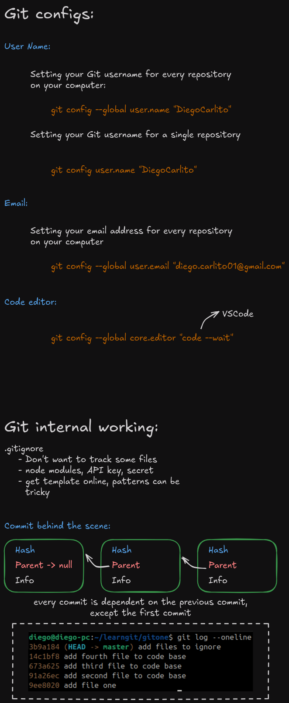

## Git Configs

1. **Configuração do nome de usuário**:
   - Para definir o nome de usuário globalmente em todos os repositórios do seu computador:
     ```bash
     git config --global user.name "username"
     ```
   - Para definir o nome de usuário apenas para um repositório específico:
     ```bash
     git config user.name "username"
     ```

2. **Configuração do e-mail**:
   - Para definir o endereço de e-mail globalmente em todos os repositórios:
     ```bash
     git config --global user.email "example@gmail.com"
     ```

3. **Configuração do editor de código**:
   - Para definir o **VSCode** como o editor padrão ao usar o Git:
     ```bash
     git config --global core.editor "code --wait"
     ```
   Isso garante que, ao editar mensagens de commit ou resolver conflitos, o Git abrirá o VSCode, esperando que o editor seja fechado antes de prosseguir com a operação.

## Git Internal Working

1. **.gitignore**:
   - O arquivo `.gitignore` é usado para indicar quais arquivos ou diretórios não devem ser rastreados pelo Git. Alguns exemplos comuns incluem:
     - **Node modules**: bibliotecas externas usadas no projeto.
     - **Chaves de API e segredos**: arquivos com dados sensíveis.
     - Arquivos temporários ou de build.
   - Pode-se encontrar templates prontos de `.gitignore` online, mas a sintaxe para definir padrões pode ser um pouco complexa.

2. **Commit por trás dos bastidores**:
   - Cada commit no Git possui um identificador único chamado **hash**, e cada commit é dependente do commit anterior, exceto o primeiro commit.
   - O gráfico na imagem mostra a sequência de commits com cada **hash** ligado ao **commit pai**, formando um histórico linear de mudanças. 
   - No exemplo mostrado no terminal:
     ```bash
     git log --oneline
     ```
     - O commit mais recente (HEAD) tem o hash `3b9a184`, que representa a adição de arquivos a serem ignorados.
     - Cada linha no log mostra o hash do commit, seguido por uma breve descrição da alteração.

## Resumo

