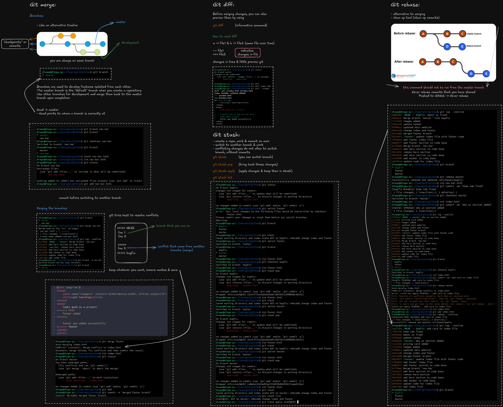

## Git Merge
O comando `git merge` é utilizado para combinar as alterações de duas branches diferentes em uma única linha do tempo.

- **Branches**: São usadas para desenvolver funcionalidades isoladas do código principal. É comum ver a branch principal chamada de **master** ou **main** e branches de desenvolvimento usadas para criar novas features.
  
- **Como o merge funciona**: Ao realizar um merge, o Git tenta unir automaticamente as alterações. Caso haja conflitos (quando o Git não sabe qual mudança aplicar), será necessário resolver manualmente esses conflitos.

- **Comandos relacionados**:
  - `git branch`: Mostra em qual branch você está atualmente.
  - `git checkout -b nome-branch`: Cria e muda para uma nova branch.
  - `git merge nome-branch`: Faz o merge da branch especificada com a branch atual.

  No caso de conflitos, o Git mostra as diferenças e marca os arquivos com linhas como `<<<<<<` para indicar onde há conflitos. Depois de resolver os conflitos, basta adicionar os arquivos corrigidos ao staging com `git add` e realizar um commit.

## Git Diff
O `git diff` compara as diferenças entre arquivos ou commits, o que é útil para revisar as alterações feitas antes de realizar um commit ou enviar para o repositório remoto.

- **Como ler o diff**:
  - `git diff file1 file2`: Mostra as diferenças entre os arquivos.
  - Linhas adicionadas são marcadas com `+` e em verde.
  - Linhas removidas são marcadas com `-` e em vermelho.
  
Isso ajuda a revisar as mudanças antes de confirmá-las, garantindo que apenas as alterações desejadas sejam incluídas no commit.

## Git Stash
O `git stash` é utilizado para salvar temporariamente alterações que ainda não estão prontas para serem commitadas. Isso é útil se você precisa alternar para outra branch, mas ainda não está pronto para realizar um commit.

- **Comandos importantes**:
  - `git stash`: Armazena suas alterações temporariamente, retornando o diretório de trabalho para um estado limpo.
  - `git stash pop`: Recupera as alterações armazenadas no stash e as aplica novamente.
  - `git stash list`: Lista todos os stashes que você armazenou.
  
Dessa forma, você pode alternar entre branches ou realizar outros comandos sem perder o trabalho em andamento.

## Git Rebase
O `git rebase` é usado para reorganizar o histórico de commits, movendo uma linha de commits para outro ponto da timeline, o que pode deixar o histórico de commits mais linear e limpo.

- **Diferença entre merge e rebase**: Enquanto o merge cria um novo commit de merge para juntar as branches, o rebase move os commits da sua branch para o topo de outra branch, resultando em um histórico mais direto.

- **Comando**:
  - `git rebase nome-branch`: Rebase na branch especificada.
  
### Cuidados ao usar o Git Rebase

Apesar de ser útil para manter um histórico de commits mais claro, o git rebase deve ser usado com cuidado, especialmente em equipes e projetos colaborativos:

1. **Nunca faça rebase em branches compartilhadas**: Como o rebase reescreve o histórico de commits, qualquer mudança em uma branch que já foi "publicada" (ou seja, já foi compartilhada com outras pessoas) pode causar conflitos e perda de histórico para os outros desenvolvedores.

2. **Conflitos de rebase**: Assim como no merge, você pode encontrar conflitos durante o processo de rebase. Entretanto, o rebase reescreve o histórico de commits, então resolver conflitos pode ser um pouco mais delicado, já que ele move commits um por um.

3. **Commits perdidos**: Se um rebase for mal executado, há o risco de perder commits, especialmente se você não verificar cuidadosamente o que está sendo rebaseado.

4. **Uso recomendado**: O rebase é ideal para manter um histórico limpo enquanto você está trabalhando localmente ou em branches privadas, onde você pode reescrever o histórico sem prejudicar o trabalho de outras pessoas.

## Resumo

